# CI/CD Pipeline

## Pipeline Flow

```mermaid
graph LR
    subgraph "Trigger"
        PUSH["git push"]
        PR["Pull Request"]
    end

    subgraph "CI"
        LINT["Lint (ESLint)"]
        TC["Typecheck (tsc)"]
        TEST["Unit + Integration Tests"]
        BUILD["Docker Build<br/>(multi-stage)"]
        SCAN["Trivy Container Scan"]
    end

    subgraph "Staging Deploy (auto)"
        STG_SSH["SSH to staging server"]
        STG_PULL["docker compose pull"]
        STG_UP["docker compose up -d"]
        STG_HC["Healthcheck<br/>curl /health"]
    end

    subgraph "Production Deploy (manual approval)"
        APPROVAL["Manual Approval<br/>(GitHub Environment)"]
        PROD_SSH["SSH to production server"]
        PROD_PULL["docker compose pull"]
        PROD_UP["docker compose up -d"]
        PROD_HC["Healthcheck<br/>curl /health"]
        ROLLBACK["Rollback on failure"]
    end

    PUSH --> CI
    PR --> CI

    CI --> LINT
    LINT --> TC
    TC --> TEST
    TEST --> BUILD
    BUILD --> SCAN

    SCAN -->|"branch: develop"| STG_SSH
    STG_SSH --> STG_PULL
    STG_PULL --> STG_UP
    STG_UP --> STG_HC

    SCAN -->|"branch: main"| APPROVAL
    APPROVAL --> PROD_SSH
    PROD_SSH --> PROD_PULL
    PROD_PULL --> PROD_UP
    PROD_UP --> PROD_HC
    PROD_HC --> ROLLBACK
```

## Workflow Files

| File | Trigger | Environment | Approval |
|---|---|---|---|
| `ci.yml` | Push to any branch, PR | CI runner | None |
| `deploy-staging.yml` | Push to `develop` | Staging server | None |
| `deploy-production.yml` | Push to `main` | Production server | Required |

## CI Stage (ci.yml)

- ESLint check
- TypeScript type checking (`tsc --noEmit`)
- Unit tests (Jest/Vitest)
- Integration tests
- Multi-stage Docker build with layer caching
- Trivy vulnerability scan on final image
- Results uploaded to GitHub Security tab

## Staging Deploy (deploy-staging.yml)

Runs automatically on every push to `develop`:
1. SSH into the staging server
2. Pull the latest Docker image
3. Restart containers with `docker compose up -d`
4. Run Prisma migrations
5. Verify health endpoint responds

## Production Deploy (deploy-production.yml)

Runs on push to `main`, requires manual approval:
1. Wait for approval via GitHub Environments
2. SSH into the production server
3. Pull the tagged Docker image
4. Restart containers
5. Run Prisma migrations
6. Verify health endpoint
7. On failure: rollback to previous image

## Rollback Strategy

If the health check fails after a production deploy:
1. Re-pull the previous Docker image tag
2. Restart containers with the previous image
3. Re-run database migrations (reverse if needed)
4. Verify health endpoint again

## Secrets Required

| Secret | Purpose |
|---|---|
| `STAGING_HOST` | Staging server hostname |
| `STAGING_USER` | SSH user for staging |
| `STAGING_SSH_KEY` | SSH private key for staging |
| `PROD_HOST` | Production server hostname |
| `PROD_USER` | SSH user for production |
| `PROD_SSH_KEY` | SSH private key for production |
| `SLACK_WEBHOOK_URL` | Slack notifications (optional) |
